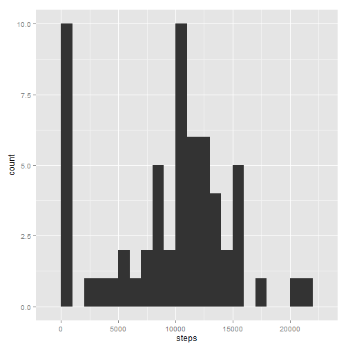
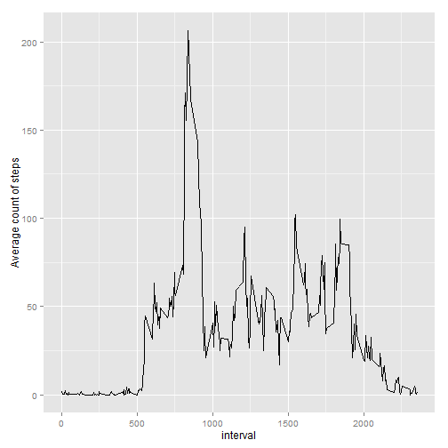
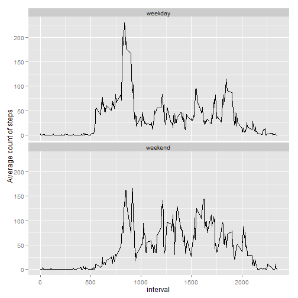

Rerproducible Research Programming Assignment 1
================================================

### Loading and preprocessing data
Let's load our data into R and transform dates varible to Date format


```r
data <- read.csv("activity.csv")
data$date <- as.Date(data$date)
```

### What is mean total number of steps taken per day?

Let's create a histogrom using ggplot2 package qplot function of total step numbers taken per day. Using tapply functtion to find sums of steps per each date. Also, let's find mean and median total number of steps taken per day (also using tapply function).


```r
library(ggplot2)
qplot(with(data, tapply(steps, date, sum, na.rm = TRUE)), binwidth = 1000, xlab = "steps")
```

 


```r
mean(with(data, tapply(steps,date, sum, na.rm = TRUE)))
```

```
## [1] 9354
```

```r
median(with(data, tapply(steps,date, sum, na.rm = TRUE)))
```

```
## [1] 10395
```

### What is the average daily activity pattern?

Let's build a plot showing average number of steps per interval and find an interval, that contains maximum numbers of steps.


```r
steps.per.interval <- aggregate(x = data$steps,list(interval = data$interval), mean, na.rm = TRUE)
ggplot(aes(x = interval, y = x), data = steps.per.interval) + geom_line() + scale_y_continuous(name = "Average count of steps")
```

 

```r
steps.per.interval[which.max(steps.per.interval$x),]
```

```
##     interval     x
## 104      835 206.2
```


### Imputing missing values

Let's find number of complete cases in the dataset.  
Then create new dataset and for replace missing (NA) number of steps with average number of steps in a specific interval from earlier created steps.per.interval dataset. Also let's see how imputing influenced some earlier results by building histogramm and finding mean and median.


```r
table(complete.cases(data))
```

```
## 
## FALSE  TRUE 
##  2304 15264
```

```r
data.na.impute <- data
data.na.impute$steps[is.na(data.na.impute$steps)] <- steps.per.interval$x[match(data.na.impute$interval,steps.per.interval$interval)]
qplot(with(data.na.impute, tapply(steps, date, sum)), binwidth = 1000, xlab = "steps")
```

 

```r
mean(with(data.na.impute, tapply(steps,date, sum)))
```

```
## [1] 10766
```

```r
median(with(data.na.impute, tapply(steps,date, sum)))
```

```
## [1] 10766
```

The histogram shows that imputing data moves 0 steps count days more to the middle bin. That also causes the increase of mean and median (which are now equal to one another).

### Are there differences in activity patterns between weekdays and weekends?


```r
data.na.impute$weekday <- weekdays(data.na.impute$date)
data.na.impute$weekday[data.na.impute$weekday == "Saturday" | data.na.impute$weekday == "Sunday"] <- "weekend"
data.na.impute$weekday[data.na.impute$weekday != "weekend"] <- "weekday"
steps.per.interval.na.impute <- aggregate(x = data.na.impute$steps,list(interval = data.na.impute$interval, weekday = data.na.impute$weekday), mean, na.rm = TRUE)
ggplot(aes(x = interval, y = x), data = steps.per.interval.na.impute) + geom_line() + facet_wrap(~ weekday, ncol = 1) + scale_y_continuous(name = "Average count of steps")
```

 

From built plots we can see that on the weekends starting from 1000 interval there are more steps than on weekdays. But the maximum value is on weekdays: more than 225 steps between 750-900 interval, while on weekends there are two peeks in that range around 160 steps each.
